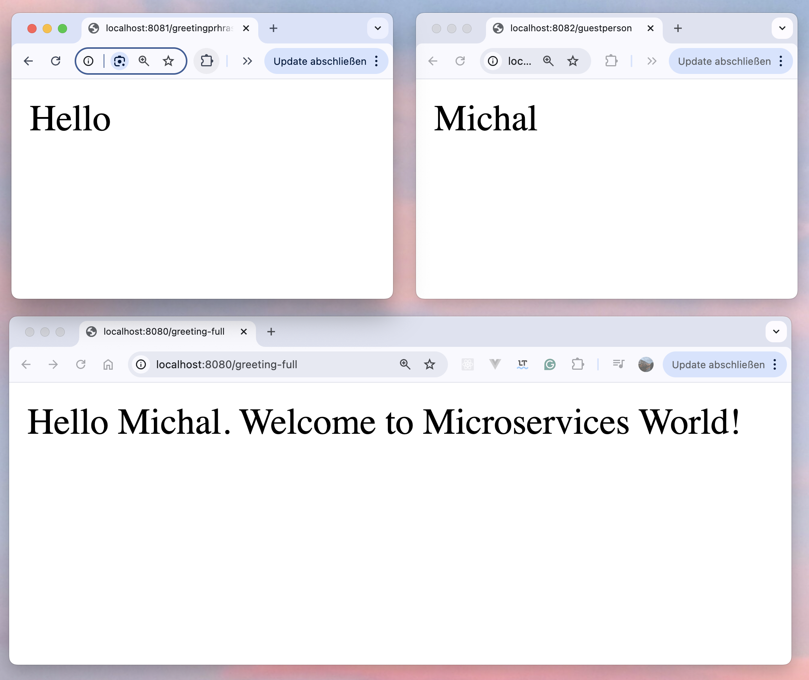
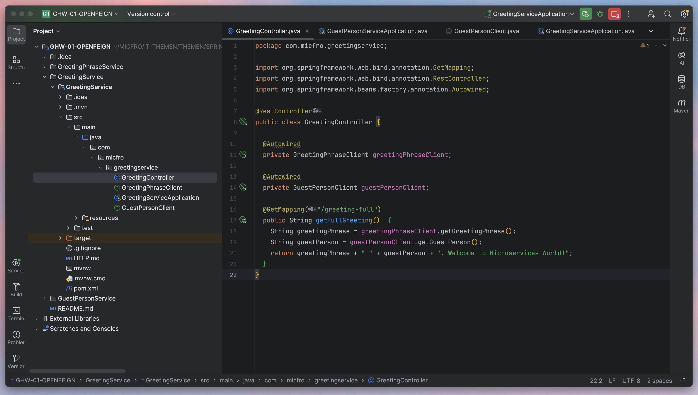

# Spring Boot Microservices - Hello World Example

This is a simple microservices-based project using Spring Boot that demonstrates the following:

- **GreetingPhraseService**: Returns the greeting phrase ("Hello").
- **GuestPersonService**: Returns the guest ("World").
- **GreetingService**: Combines the two services and displays the full greeting ("Hello World").

## Architecture

This project consists of three microservices:

1. **GreetingPhraseService**: Returns the greeting phrase. Runs on port `8081`.
2. **GuestPersonService**: Returns the name of the guest. Runs on port `8082`.
3. **GreetingService**: Fetches data from the two other services and displays the combined message. Runs on port `8080`.

### Technologies Used

1. **Spring Boot**: The primary framework used to build the RESTful microservices.
    - Spring Boot simplifies the development of Java-based microservices by providing out-of-the-box features like auto-configuration, an embedded web server (Tomcat), and dependency management.

2. **Spring Web**: For building REST APIs in all three microservices.
    - Provides simple and efficient ways to create RESTful web services using annotations like `@RestController` and `@GetMapping`.

3. **Spring Cloud OpenFeign**: Used for service-to-service communication.
    - Feign simplifies HTTP-based microservice communication by automatically generating clients for external APIs based on annotated interfaces.


### Microservices Overview

1. **GreetingPhraseService**:
    - **Endpoint**: `/greetingphrase`
    - **Response**: `"Hello"`

2. **GuestPersonService**:
    - **Endpoint**: `/guestperson`
    - **Response**: `"World"`

3. **GreetingService**:
    - **Endpoint**: `/greeting-full`
    - **Response**: `"Hello World"`


### Getting Started

1. **Clone the repository**:
   ```bash
   git clone https://github.com/your-repository-url/spring-boot-microservices-hello-world.git
   cd spring-boot-microservices-hello-world

### Autor
Created by Michal Frost

### Screenshots



